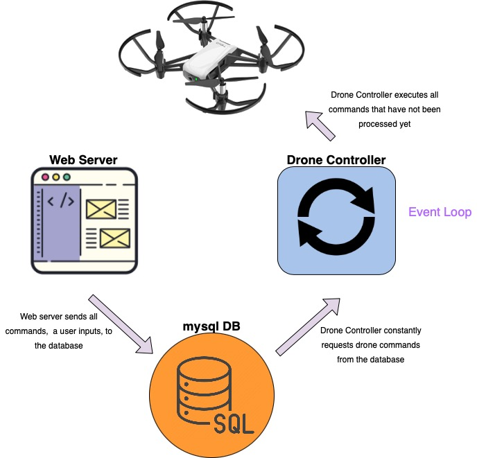
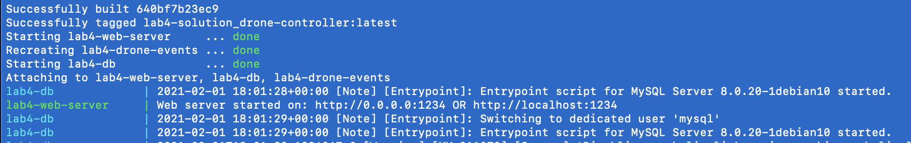
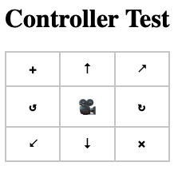
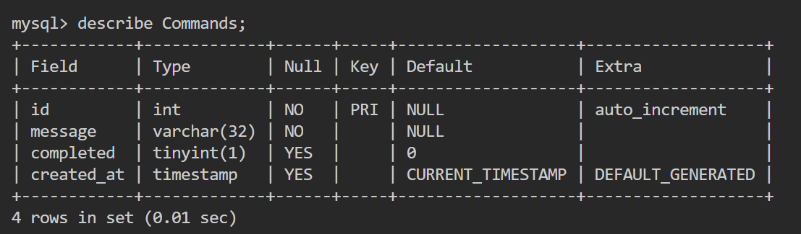

# Lab 4 - Drone Controller

## Due Date

Feb 9 @ 9 p.m. PST

## Prerequisites

This lab builds on prior work we've done in class and in the labs. It is **vital** that you have seen all the related videos *before* attempting to do this lab:

1) Video lecture on [HTML](https://www.youtube.com/watch?v=Ht5nE2l4mJI)
2) Video lecture on [Web Serving Fundamentals](https://www.youtube.com/watch?v=5a0R2yiiEeo)
3) Video lecture on [REST](https://www.youtube.com/watch?v=YHZmSlF-rOU)
4) Video lectures on Javascript
    1) [Introduction to Javascript](https://www.youtube.com/watch?v=E0_pEASqB3A&feature=emb_title)
    2) [Interactions](https://www.youtube.com/watch?v=Mwf_qU6zQfo)
    3) [Asynchronous javascript + JSON](https://www.youtube.com/watch?v=eusDs93MlnQ)
5) DB Intro Videos(Pick one of these):
    1) Intro to Database [Video](https://youtu.be/3_GMPJFF1sI)
    2) Advanced Intro to Database [Video](https://youtu.be/GsSagoCByzc)
6) DB Crud Operations [Video](https://youtu.be/FV0hr-cw47A)
7) DB Join Operations [Video](https://youtu.be/-LqlkZ6S7p4)
8) RESTful Databases
    1) [Video 1](https://youtu.be/czJYswiRx-g)
    2) [Video 2](https://youtu.be/U73e3TJxvxM)

## Overview

**Note, this is a DENSE lab! Please start early to avoid last minute questions as there may not be enough manpower for the instruction staff to help.**

We will be building a web-based controller for our drone. By the end of this lab, you will build an interface to control your drone. Our database gets an upgrade and we will now be working with a MySQL database instead of just JSON. We now have three servers:

1. `web-server`  (a web server in Python that talks to the DB)
2. `mysql-db`  (a database server you talk to using SQL)
3. `drone-controller`  (a Python program that talks to the DB and drone API)

Our `web-server` container is similar to the `frontend` server that you worked with in Lab 3 – it provides users with a web interface they can use to send commands to the database server (and ultimately control the drone). The `drone-controller` is where all communication with the drone takes place – it continuously looks for new commands in the database and executes them as they come in. The `mysql-db` database server takes care of storing and retrieving commands that were sent from the `web-server`, to and from a persistent database. The image below provides an overview of the system.



Notice that the web server does not directly communicate with the drone controller. Instead, when a user interacts with a webpage you create, it sends RESTful requests to the the web server, which in turn communicates with the database. The drone controller actively looks for a new commands in the database (Commands table) that have not yet been executed. As new commands come in, the drone controller executes them one-by-one in the order in which they arrived. For more information on how an event loop works, refer to [here](https://en.wikipedia.org/wiki/Event_loop#:~:text=In%20computer%20science%2C%20the%20event,or%20messages%20in%20a%20program.).

The first thing you will need to do is to create a credentials file that allows you to access the MySQL server in the docker container. Create a credentials.env file in the root of this directory and add the following 5 values. You will need to make up the last 3 fields:

```bash
  MYSQL_HOST=mysql-db
  MYSQL_DATABASE=lab4ece140a
  MYSQL_ROOT_PASSWORD= [...]
  MYSQL_USER= [...]
  MYSQL_PASSWORD= [...]
```

We can simultaneously start all three containers using: `docker-compose up --build`.
You will see something like this further along in your console output:


Now, open up your browser and go to `0.0.0.0:8000`, or if that doesn't work, you might need to use `localhost:8000`. You should see your browser display the text **"Drone Controller"**

**Note**: You will only need to modify the following set of files for the lab:

1. `command-dispatcher.py`
2. `init-db.sql`
3. `web_ui.css`
4. `web_ui.js`
5. `web_ui.html`
6. `server.py`

## Challenge 1 - Controller Design

Your first challenge is to design an interface (HTML/CSS/JS) on the `web-server` to interact with the MySQL database. You have the freedom to make it as pretty and interactive as you'd like using CSS and JavaScript. An example of a controller design is shown below, but you are free to get creative:



1.1 You will be using `web_ui.html` to implement the controller: you can use buttons, divs, tables, anything you want as long as each box can be clicked and be used for drone controls later in this lab. The specific buttons you will need to implement are: **takeoff, up, forward, ccw, cw, back, down and land**. You can reference the  `valid_commands` in `server.py` to confirm. You can design it to look any way you like, you don't have to follow the example above.

1.2 Construct a slider, a dropdown, an input field, or whatever you like that can hold a numeric value on the same `web_ui.html` page. It will be used later to dictate the magnitude of the commands being sent (ex: "up 50", "left 60", etc). You can implement this however you like.

1.3 You will use `web_ui.css` to add any styling to the controller and the page that you would like. Be as creative as you like!

1.4 You will use `web_ui.js` to handle the button clicks. You can implement the button handling in any way that you like, but the commands need to be sent to predefined RESTful route on the server. Essentially, you need to take the button pressed and figure out which command it is (takeoff, land, left, etc.) and call the RESTful route `/drone_command/{command}*arg` with that command. We have already implemented the route for you in `server.py`, so you just need to call it from your JavaScript using the `fetch` function and the concepts we showed in the JavaScript tutorial video.

As we mentioned, a route to send commands from the web-server has been already added for you. It looks like this:

```python
    config.add_route('drone_command', '/drone_command/{command}*arg')
    config.add_view(drone_command_route, route_name='drone_command', renderer='json')
```

Notice that this is unlike any of the routes you have seen so far. Unlike static routes, which we have been working with so far, this route allows you to pass parameters and thus dynamically control the execution. If we stuck with static routes, we would have to create a separate route for each type of drone command. Do you see how this can quickly add up to too many routes?

*To check for valid commands the route in `server.py` accepts, please reference the  `valid_commands` in `server.py`*

Note that this amounts to constructing URL's of the following form using JavaScript fetch:

`http://localhost:8000/drone_command/up/20` -> represents instructing the drone to go 'up' by 20cm

`http://localhost:8000/drone_command/takeoff` -> represents instructing the drone to take off.

>  Also **NOTE** that not all commands require arguments. See [Tello SDK Documentation](https://dl-cdn.ryzerobotics.com/downloads/tello/20180910/Tello%20SDK%20Documentation%20EN_1.3.pdf) to view acceptable commands.**

The arguments for linear motion controls (forward, back, up, left, etc.) and rotational controls (clockwise, counter-clockwise) will need to be variable via your controller interface. You can use a slider, a dropdown, or whatever UI you like to set the values. This value will be passed as the `arg` part of the RESTful route.

The `drone_command_route` function is responsible for parsing the provided command and translating it to the appropriate syntax that the Tello drone understands. We also check that the sent command is valid.

Before you continue, make sure you have:

- A controller interface built with some styling
- The buttons on the interface correctly call the `/drone_command/{command}*arg` and print the name of command in server terminal correctly.

## Challenge 2 - Database Initialization

In this step, we will build the database to store all drone commands to a MySQL database. You will need to create a table named `Commands` with the following schema:



Add your SQl code to create the table inside the `init-db.sql` file.

Next, you will need to complete `send_command` in `server.py`. In this function, you will need to connect to the database using the DB credentials loaded from your `credentials.env` as environment variables. Note, the variables are already present at the top of `server.py` so you just need to pass them to MySQL Connector to open a connection. Next, insert the command record into the Commands database table. **Don't forget to commit your changes to the database!**

## Challenge 3 - Drone Command Dispatching

In this challenge, you will read a single command from the Commands table at a set interval, making sure that you only retrieve commands that are not completed. Then you will dispatch the command to the drone. Finally, you will update that record in the database so that it is marked as completed.

Note that the Commands table has a *completed* key that indicates whether a given command was executed or not. This is the key that you would need to update in the table. This will ensure that only the commands that have not yet been executed will be sent to the Tello drone. Make sure that you are only marking the command that you actually completed as being completed. It's very easy to accidentally mark all commands as completed on accident.

For this challenge, you will need to edit the file `command-dispatcher.py`.

You may have noticed that the API we are using to communicate with the drone is very different. This is because we are no longer using the DJITelloPy API and instead built our own simple API. You are encouraged to review the way the API has been implemented in `tellolib.py` but are not required to modify it. From Lab 2, you may have realized that the drone shuts off if it does not receive a command within 15 seconds. To avoid having to restart the drone each time, we have added functionality to send a heart-beat command to the drone. What this essentially does is issue a *get_battery* command if no command was sent in the past 10 seconds.

## Deliverables

You will need to have built a web-based controller that interfaces with the drone. Please record a video* using your phone showing evidence of being able to fly the drone with the controller you just built. Please show at least the following commands in your video: **TAKEOFF, LAND, UP, DOWN, FORWARD, BACK, ROTATE CLOCKWISE, ROTATE COUNTERCLOCKWISE**.

*Please limit videos to 3 minutes and upload it to YouTube

For the Drone Flight Video, please create a file called `video_link.txt` and paste the youtube video URL in there.

Once you are finished, push all of your code to Github. Good luck!

**Again, this is a dense lab, please start early.**
